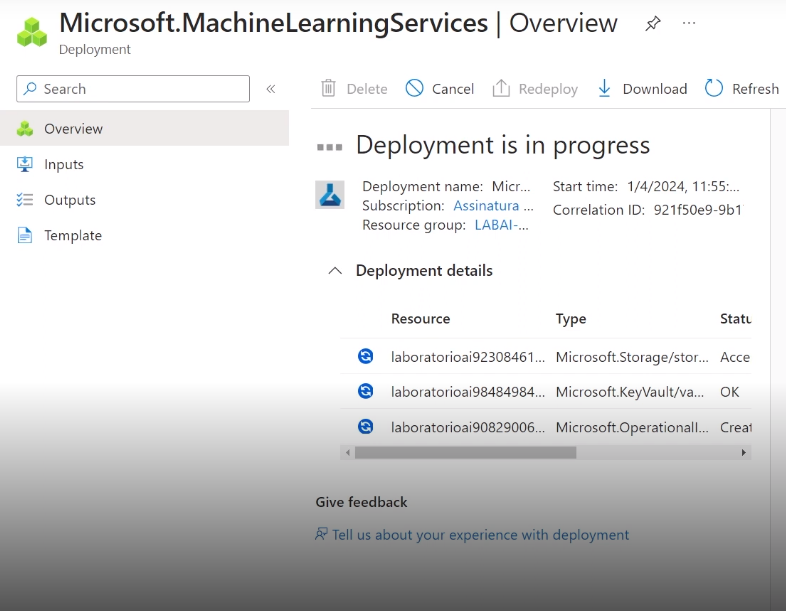

# Nesse readme irei mostrar como trabalhar com machine learning na prática no azure ML. Segue os passos;

# Passo 1 - Crie sua conta

### [criar conta no azure](https://azure.microsoft.com/pt-br/free/search/?ef_id=_k_EAIaIQobChMIgIL0xZC7hAMV_GJIAB0aiwAzEAAYASAAEgInG_D_BwE_k_&OCID=AIDcmmzmnb0182_SEM__k_EAIaIQobChMIgIL0xZC7hAMV_GJIAB0aiwAzEAAYASAAEgInG_D_BwE_k_&gad_source=1&gclid=EAIaIQobChMIgIL0xZC7hAMV_GJIAB0aiwAzEAAYASAAEgInG_D_BwE)

para o que vou demonstrar aqui você pode seguir a documentação desse laboratório

### [documentação](https://microsoftlearning.github.io/AI-900-AIFundamentals/instructions/02-module-02.html)

# Passo 2 - Acessando o serviço da azure Machine-Learning

A primeira coisa que você deve fazer após logar com sua conta
é procurar por **Machine Learning** na barra de buscar ou clique em
**Criar um recurso**


após isso você deve clicar em **create**


### preenchimento:

**Subscription** é sua conta, não precisa alterar
**resource group** é onde você vai guardar o seu laboratório, pense que é
como o nome do seu projeto ou a sua gaveta de tarefas desse laboratório
salvo na nuvem.

**workspace details**
**name** coloque um nome exclusivo para o seu laboratório
**region** coloque a mais próxima ex: East US
os que não forem comentados aqui não precisa mexer.

após isso clique em **Review + create** depois em **create**

obs: a validação precisa passar, se não passar volte e compare com o documento
ou veja a descrição do motivo de não ter passado.

agora acompanhe o seu deploy na página de progresso



# Passo 3 - Configure o modelo e o conjunto de dados

Após a conclusão do deploy clique em **Go to resource**


Agora clique em **Launch studio**
Ele ira te pedir pra você criar um workspace, coloque os dados necessários
e você será redirecionado para a tela de Estúdio:


Entre no seu **Recent workspaces**
após isso na barra da esquerda procure por ML automatizado:


vá em **Novo trabalho de ML Automatizado**
Na parte de configuração básica você pode seguir a documentação para o
preenchimento: vá para _In Azure Machine Learning studio, view the Automated ML page (under Authoring)._
_Create a new Automated ML job with the following settings, using Next as required to progress through the user interfac_
Lá você encontrará as informações para o preenchimento.

após a conclusão de **Tipo de tarefa e dados** clique em avançar e vamos para configuração de tarefas, na documentação vá para _Task settings:_.


Ao concluir todos os passos você devera cair na página de validação, observe
que essa validação levara um tempo, ele precisa aparecer como **Concluído**.


# Passo 4 - Análise e teste de modulo

Após concluído observe que você poderá analisar algumas métricas para analisar
alguns cenário desse treinamento. Nessa área você tem todo um esquema de analise
de acurácia e predição dos dados.


o próximo passo é você clicar em **Pontos de extremidade** na documentação você
encontra sobre essa área em _Test the deployed service_.

Após conseguir clique em **treinar**, caso você receba esse erro:


fique tranquilo é só copiar o código da documentação em _Test the deployed service_
e mudar o campo **inputs** para **input_data** e seja feliz.

meu resultado:

```
 [1 item
 0:float363.8736625740296
 ]
```

a entrada:

```
{
  "input_data": {
    "data": [
      {
        "day": 2,
        "mnth": 23,
        "year": 2024,
        "season": 2,
        "holiday": 0,
        "weekday": 1,
        "workingday": 1,
        "weathersit": 2,
        "temp": 0.3,
        "atemp": 0.3,
        "hum": 0.3,
        "windspeed": 0.3
      }
    ]
  },
  "GlobalParameters": 1.0
}
```
